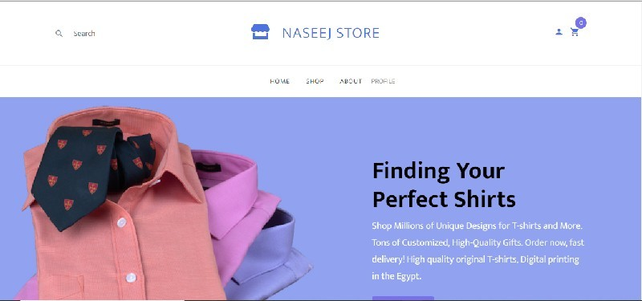

Welcome to Naseej store web App.

this is an Ecommerce web application, created using Servlet and JSP and Hibernate technologies.
using Ajax foe dynamic web pages.
the application is a full ecommerce service can register clients show them products according to their interests, 
filtering results by colors, sizes and categories.
the client can complete the shopping proccess by choosing and adding items to his cart, choose the address and the way of payement, and checkout his order.
each client has a profile, cotaining his credintials, profile photo, the cridet limit and the addresses. 
the application display sales and contact process.

The Technologies Used in this Project are:-
HTML5
CSS
jQuery
Javascript
Bootstrap
Java
Hibernate, JPA
JSP
Servlet
ORM / Hibernate
MySql
Ajax

Invironment Used:-
Intellij IDE
Maven
Tomcat 10 Web server ( for development purposes)
Git (GitHub)

Refer to for the entity model 

The Project file structure (architecture) Referd to in 

Screen Shots from the application mobile view and wide screen view is available in 

  
Team members:
Mohamed Elsisi (Team leader), 
Ahmed ElSayed, 
Amira Nasr, 
Hager Abdelmoneom,
Yasmina Abdelazim,

Copy rights Reserved ITI ( information technology inistitue) Smart village - 2021 - intake 41 - Jets Departement.
 
